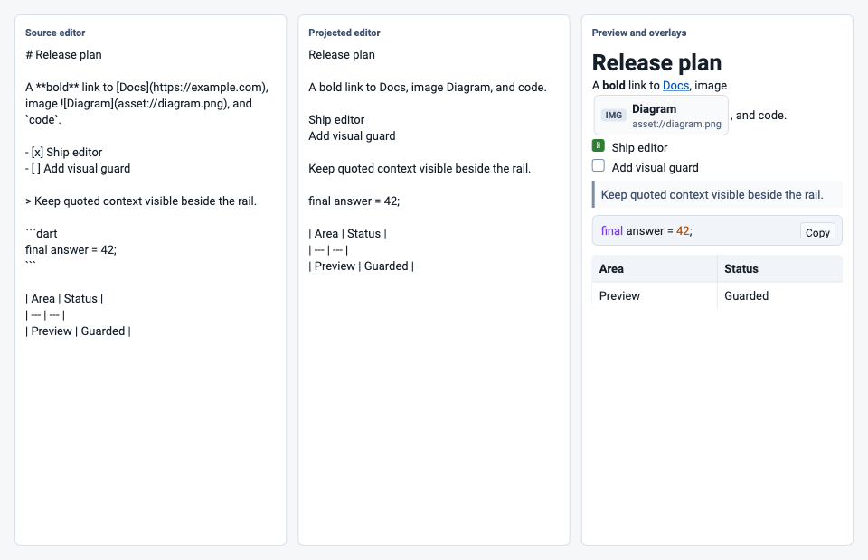

# sovereign_editor

Source-first Markdown editing and preview for Flutter.

Sovereign keeps Markdown source as the canonical document, runs editing through
a pure Dart transaction/runtime core, and uses Flutter as the rendering and
platform-input adapter. The default parser is required Comrak: FFI on native
targets and the packaged WASM bridge on web. Custom deployments can still
supply any `SovereignMarkdownParseBackend`.



## Quick Start

```dart
import 'package:sovereign_editor/sovereign_editor.dart';

MarkdownEditor(
  initialMarkdown: '# Hello\n\nEdit **Markdown** without losing the source.',
  editingMode: SovereignMarkdownEditingMode.liveRendered,
  onChanged: (markdown) {
    // Persist the Markdown source.
  },
)
```

Standalone preview:

```dart
Markdown(markdown: '# Preview')
```

`initialMarkdown` is initial-only for an editor instance. Store changes from
`onChanged`, but use a new widget key or a shared
`SovereignFlutterController` when switching to a different document.

## Why Sovereign

- Source Markdown is the durable model. Projected editing is an adapter, not a
  replacement document format.
- The headless Dart core owns transactions, history, commands, projection, and
  render plans without Flutter imports.
- Native parser payloads are schema-versioned and tested against upstream
  CommonMark/GFM fixtures.
- Editable and read-only surfaces consume the same render plan, so previews,
  overlays, and custom renderers do not reparse independently.
- Live rendered editing styles projected Markdown in place and renders parsed
  tasks, code fences, and tables as editable block widgets while preserving
  the source-first transaction model.
- The package is v2-only. The old `SovereignController`/`SovereignEditor`
  compatibility layer has been removed.

## Imports

- `package:sovereign_editor/sovereign_editor.dart`: supported app API.
- `package:sovereign_editor/sovereign_editor_core.dart`: headless runtime,
  transactions, parser DTOs, projection, and render plans.
- `package:sovereign_editor/sovereign_editor_v2.dart`: complete advanced v2
  surface for parser and extension integrations.

Deep imports are for package tests and implementation work only.

## Widget Guide

Start with one of these two widgets:

| Widget | Use it when | State owner |
| --- | --- | --- |
| `MarkdownEditor` | You need editable Markdown. Pass `initialMarkdown` for the simple case or `controller` when toolbars, save state, undo/redo UI, or preview need shared state. | Widget-owned or app-owned |
| `Markdown` | You need read-only Markdown. Pass `markdown` for the simple case or `controller` to preview the same render plan as an editor. | Widget-owned or app-owned |

Choose source, projected, or live-rendered editing with
`MarkdownEditor(editingMode: ...)`.

## Shared Editor and Preview

For split-pane editor/preview experiences, share one
`SovereignFlutterController` and render `Markdown` beside the
editor so both surfaces consume the same parse/projection/render-plan state.

```dart
final controller = SovereignFlutterController.fromMarkdown(
  '# Hello\n\nEdit **Markdown** without losing the source.',
);

Column(
  children: [
    MarkdownEditor(
      controller: controller,
    ),
    Markdown(controller: controller),
  ],
)
```

`MarkdownEditor` owns the parse scheduler for that shared-controller
setup when `parseBackend` is omitted. The standalone
`Markdown(markdown: ...)` widget is simpler when the preview
does not need to share live editor state.

## Toolbar Commands

Common Markdown actions are exposed as controller helpers so app toolbars do
not need to construct command payloads for routine editing:

```dart
IconButton(
  icon: const Icon(Icons.format_bold),
  onPressed: () => controller.toggleStrong(),
)

IconButton(
  icon: const Icon(Icons.table_chart),
  onPressed: () => controller.insertTable(columns: 3, bodyRows: 2),
)
```

The helpers return `SovereignEditorRuntimeResult`, so advanced integrations can
still inspect whether a command was handled or rejected.

## Native and Web Parser Model

The promoted widgets require the packaged Comrak backend by default. On web
this loads the packaged Comrak WASM artifact; on native targets it uses the
bundled FFI bridge. Backend load failures are surfaced directly so consumers do
not silently run a different Markdown implementation. Apps that need custom
parser policy can still supply their own `SovereignMarkdownParseBackend`. Use
`onParseError` on `MarkdownEditor` or `Markdown` to
log or display scheduled background parser failures.

```dart
final preflight = SovereignNativeComrakParseBackend.preflight();
if (!preflight.isAvailable) {
  debugPrint(preflight.error.toString());
}
```

Native Comrak is supported on macOS, iOS, Android, and Linux through the
package native-assets / XCFramework flow. Web uses the packaged
`lib/assets/wasm/sovereign_comrak_bridge.wasm` artifact through Dart JS interop.
The web parser strategy is documented in
`docs/architecture/v2/web_parser_strategy_2026-05-03.md`.

## Custom Preview Blocks

Use render-plan customization rather than reparsing Markdown in widgets:

```dart
Markdown(
  controller: controller,
  blockBuilder: (context, block, displayText, style) {
    if (block.codeBlock == null) return null;
    return Text(displayText.substring(
      block.displayRange.start,
      block.displayRange.end,
    ));
  },
)
```

For semantic changes that should travel with the runtime, register a
`SovereignRenderPlanExtension`.

## Example App

The `example/` app is the package integration harness. It imports only
`package:sovereign_editor/sovereign_editor.dart`, exposes source, projected,
and live rendered block-widget editing, preview rendering, toolbar commands,
and scenario buttons for common Markdown cases.

```bash
cd example
flutter run -d macos
```

The macOS target is the preferred local dogfood app for live editing. It opens
as a desktop workbench with document scenarios, toolbar commands, native parser
status, and a live preview pane. Choose `Scratch` in the document sidebar for a
blank document that is ready for freeform typing. The mode switch covers
`Live Edit` for rendered-in-place Markdown editing beside rendered output,
`Source` for raw Markdown editing, `Projected` for marker-hidden text editing,
and `Rendered` for the read-only render-plan surface. Live Edit renders task
checkboxes, fenced code regions, and tables as editable widgets that still
write Markdown source transactions. The editor pane uses `expands: true` so
the whole document surface is a writing target, including empty documents.

## Native Build Workflow

For app builds on macOS, Linux, and Android, prefer the native-assets hook:

1. Ensure Rust is available on `PATH`.
2. For Android, ensure an Android NDK is discoverable through
   `ANDROID_NDK_HOME`, `ANDROID_NDK`, `ANDROID_NDK_ROOT`,
   `ANDROID_NDK_LATEST_HOME`, or `ANDROID_HOME`.
3. Build the app normally; the Dart/Flutter build hook compiles and bundles the
   native library.

For package development and local white-box native tests:

```bash
./scripts/build_comrak_all.sh
./scripts/build_comrak_all.sh --strict
./scripts/build_comrak_all.sh --host-only
./scripts/build_comrak_all.sh --wasm-only
```

## Verification

Fast confidence gate:

```bash
./scripts/verify_package_confidence.sh
```

Full release gate:

```bash
./scripts/verify_release.sh
```

Desktop dogfood flow:

```bash
cd example
flutter test integration_test/markdown_flow_test.dart -d macos
```

Visual regression suite:

```bash
flutter test test/v2/flutter/sovereign_v2_visual_golden_test.dart
```

Regenerate visual baselines only after intentional review:

```bash
flutter test --update-goldens test/v2/flutter/sovereign_v2_visual_golden_test.dart
```

Benchmark lane:

```bash
./scripts/verify_benchmark_lane.sh
```

## Test Layout

- `test/v2/core`: headless runtime, transactions, history, command registry.
- `test/v2/markdown`: commands, parser protocol, native parser contracts.
- `test/v2/projection`: hidden-range and source/display mapping contracts.
- `test/v2/render_plan`: shared render-plan generation.
- `test/v2/flutter`: Flutter adapters, projected editing, live rendered
  editing, preview widgets, web smoke tests, and visual goldens.
- `test/v2/native`: native bridge payload and loader contracts.

## Release Status

The package is intentionally unpublished while `publish_to: none` remains in
`pubspec.yaml`. Release metadata and owner decisions are tracked in:

- `CHANGELOG.md`
- `docs/production_readiness/release_checklist_2026-05-02.md`
- `docs/architecture/v2/execution_plan.md`
- `docs/architecture/v2/execution_log.md`
