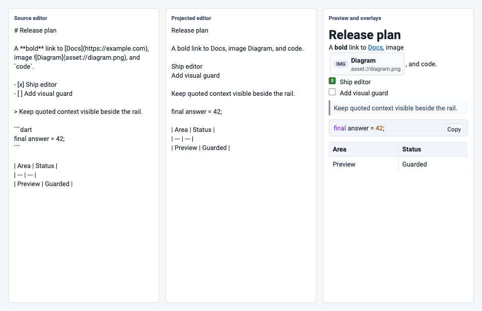

# Flark

Live Markdown infrastructure for Dart and Flutter.

The `flark` package is the platform-neutral engine. The `flark_flutter`
package adds Flutter input, rendering, widgets, and form integration:

Today the supported editor is the v2 Comrak-backed implementation. The
Flutter-independent v3 session/parser architecture is the selected production
direction and remains an explicit preview until its isolate/Worker and public
facade gates close.

Live demo and package site: <https://danreynolds.github.io/flark/>

> **Status:** pre-1.0. Runs on macOS, iOS, Android, Linux, and web —
> **Windows is not supported yet** (the parser is a Rust/WASM Comrak bridge;
> see [Platform Support](#platform-support-and-build-requirements)). The API
> may still change between minor versions; breaking changes are called out in
> the [CHANGELOG](CHANGELOG.md).

```dart
import 'package:flark_flutter/flark_flutter.dart';

FlarkMarkdownEditor(
  initialMarkdown: '# Hello\n\nEdit **Markdown** without losing the source.',
  editingMode: FlarkMarkdownEditingMode.liveRendered,
  onChanged: saveMarkdown,
)
```

```dart
FlarkMarkdown(markdown: '# Preview')
```

The document truth stays FlarkMarkdown. The editor, preview, toolbar commands,
projection layer, and rendered block widgets all work from that same source
document instead of converting user content into a private rich-text model.



## Why Flark

- `FlarkMarkdownEditor` edits Markdown in source or live-rendered mode.
- `FlarkMarkdownEditorFormField` wires the editor into Flutter `Form` validation,
  saving, and reset flows.
- `FlarkMarkdown` renders read-only Markdown from a string or a shared
  controller, with optional text selection (`selectable: true`).
- `FlarkFlutterController` keeps editor, preview, toolbar, undo, redo, parser
  state, and render plans in sync.
- The default parser is Comrak: native FFI on macOS, iOS, Android, and Linux;
  packaged WASM on web.
- The Dart engine owns transactions, commands, projection, history, parser
  lifecycle, and render plans without importing Flutter.
- `flark_flutter` depends on `flark`; the engine never depends on Flutter.

## Shared Editor and Preview

Use a controller when multiple surfaces should track the same document:

```dart
final controller = FlarkFlutterController.fromMarkdown(
  '# Hello\n\nEdit **Markdown** without losing the source.',
);

Column(
  children: [
    Expanded(child: FlarkMarkdownEditor(controller: controller)),
    Expanded(child: FlarkMarkdown(controller: controller)),
  ],
)
```

`initialMarkdown` is only used to create a widget-owned controller. For
document switching, pass a new widget key or manage a `FlarkFlutterController`
yourself.

## Toolbar Commands

Toolbar code talks to the controller, not the widget tree:

```dart
IconButton(
  icon: const Icon(Icons.format_bold),
  onPressed: () => controller.commands.toggleStrong(),
)

IconButton(
  icon: const Icon(Icons.table_chart),
  onPressed: () => controller.commands.insertTable(columns: 3, bodyRows: 2),
)
```

Command helpers return `FlarkEditorRuntimeResult`, so advanced integrations can
inspect whether a command was handled, ignored, or rejected.

## Theming

Every chrome color — code fences, quotes, links, tables, checkboxes, menus,
syntax highlighting — comes from a `FlarkMarkdownThemeData`. The default
follows platform brightness (light/dark); pass `theme:` to a widget or wrap a
subtree in `FlarkMarkdownTheme` to control it:

```dart
FlarkMarkdownEditor(
  controller: controller,
  theme: FlarkMarkdownThemeData.dark.copyWith(linkColor: myBrandBlue),
)
```

Text sizing and fonts come from the widget `style`/`textStyle`; the theme owns
colors.

## Imports

Flutter apps should depend on `flark_flutter` and use one import:

```dart
import 'package:flark_flutter/flark_flutter.dart';
```

Pure-Dart consumers depend on `flark`:

```dart
import 'package:flark/flark.dart';
```

Advanced imports are split by package:

- `package:flark/flark_core.dart`: document/runtime/projection/render
  plan APIs.
- `package:flark/flark_advanced.dart`: full engine, parser, native bridge, and
  extension surface.
- `package:flark_flutter/flark_flutter_advanced.dart`: full Flutter adapter
  plus the engine adapter SPI.

Deep imports under `src/` are for Flark internals and white-box package tests.

Dart web applications can own parser-module delivery without a Flutter asset
API:

```dart
final backend = FlarkNativeComrakParseBackend.withNativeBridge(
  wasmSource: NativeComrakWasmUriSource(
    Uri.parse('/assets/flark_comrak_bridge.wasm'),
  ),
);
```

`NativeComrakWasmBytesSource` is available when the application already owns
the module bytes. Dart-only web deployments must serve or load the packaged
`flark_comrak_bridge.wasm` file and provide its URI or bytes explicitly;
`flark_flutter` performs that asset-bundle step automatically for Flutter web.

## Performance

Editing stays on the synchronous fast path — a keystroke applies in
microseconds through 100 KB documents:

| Document | Keystroke apply (median) | Native parse + decode (median) |
| --- | --- | --- |
| 1 KB | 4 µs | 1 ms |
| 100 KB | 172 µs | 55 ms |
| 1 MB | 5.5 ms | ~0.5 s |

Both paths are linear in document size. See [Benchmarks](doc/benchmarks.md) for
the enforced lane and methodology.

## Platform Support and Build Requirements

| Target | Parser backend | Toolchain |
| --- | --- | --- |
| macOS, iOS, Linux | Native Comrak (Rust FFI) | Rust (`rustup` recommended) |
| Android | Native Comrak (Rust FFI) | Rust + Android NDK |
| Dart web | Comrak WASM | serve the packaged module and provide its URI/bytes |
| Flutter web | Packaged Comrak WASM | none (adapter loads the bundled asset) |
| Windows | — | not supported yet |

Native consumers compile the bundled Rust bridge through `flark`'s package
build hook; Flutter receives that native asset transitively through
`flark_flutter`. A Rust toolchain must be on `PATH` for native builds. Web
needs no Rust toolchain; Dart-only web apps choose the public URL or byte loader
for the prebuilt module, while the Flutter adapter configures its asset bundle.
See
[Parser and Platforms](doc/parser_and_platforms.md) for details.

## Documentation

- [Getting Started](doc/getting_started.md)
- [Cookbook](doc/cookbook.md)
- [API Surface](doc/api_surface.md)
- [Parser and Platforms](doc/parser_and_platforms.md)
- [Development and Verification](doc/development.md)
- [Benchmarks](doc/benchmarks.md)
- [Architecture Notes](doc/README.md)

## Example App

The `example/` app is the dogfood workbench and GitHub Pages site. It imports
only `package:flark_flutter/flark_flutter.dart` and exercises source,
live-rendered, form, toolbar, docs, and read-only rendering flows.

```bash
cd example
flutter run -d macos
```

## Verification

Fast local confidence gate:

```bash
./scripts/verify_package_confidence.sh
```

Full release gate:

```bash
./scripts/verify_release.sh
```

Visual baselines:

```bash
cd packages/flark_flutter
flutter test test/v2/flutter/flark_v2_visual_golden_test.dart
```

## License

Flark is available under the MIT license. See [LICENSE](LICENSE).
