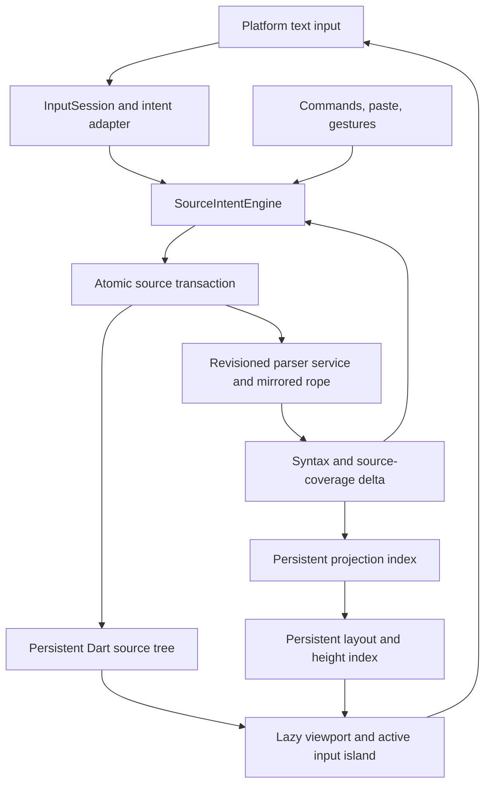

# RFC 023: Incremental live Markdown engine

> **Historical v3 architecture record.** [RFC 026](rfc_026_flark_v4_product_architecture.md),
> [RFC 027](rfc_027_continuously_rendered_markdown.md), and
> [RFC 029](rfc_029_large_document_architecture.md) replace its Dart-first
> topology and production status. The [v4 build plan](../v4/build_plan.md) is
> the current execution contract; the paths and acceptance table below are
> historical receipts, not active gates.

**Historical status (2026-07-22):** SELECTED ARCHITECTURE — production implementation active; launch
remains HOLD, 2026-07-22.
**Author:** architecture investigation follow-through.
**Implementation baseline:** [Flark v3 definitive architecture summary](../v3/architecture_summary.md).
**Historical disposition:** This RFC was the selected architecture for the v3
engine. The engine is Dart-first: the `flark` package is pure Dart and
`flark_flutter` is a dependent platform adapter. The topology is one exact
Flark-owned, donor-correspondent controller;
Crop worker revisions; a packed source-ordered serialized-green document with
unified physical/logical projection runs; exact restart/convergence; bounded
inline/reference services over authenticated projections; a one-current-root
Dart source with bounded inverse history; and revision-safe viewport
materialization. Comrak, Pulldown, and cmark-gfm supply localized algorithms
and differential oracles, not competing runtime state models.

The implementation sequence is governed by the
[production plan](../v3/implementation_plan.md). In particular, M1.1 first
proves a clean-but-resumable exact slice through the final atomic publication
and query seams; restart and authenticated suffix adoption follow behind those
same contracts. That staging does not narrow the large-document architecture
or introduce a second grammar authority.

The later executable gates strengthen this direction and supersede older body
text that describes the slices as wholly disconnected. The v3 Dart engine and
Flutter adapter mechanism is analyzer-clean and 66/66 green, including direct
`TextEditingDelta` routing, bounded bulk-paste adoption, scalar/CRLF-safe input
islands, global selection, and IME-preserving handoff. The exact Rust slice has
a 44/44 Setext receipt, including retained restart and a generalized
normalize-before-parent-crossing rule for Open, Close, and Finish. Its
authenticated two-pass Table cursor is 4/4 green without a cloneable Paragraph
snapshot, backed by green isolated scanner and priority suites. The source
projection composer has a 22/22 line-boundary receipt and retains at most 224
bytes of scalar continuation while deriving its redundant generation from the
sealed-run count. The active-Paragraph projection path adds focused 7/7 cursor
and 2/2 source-session receipts: range replay is actor-owned and non-cloneable,
far-range work seeks through the index without a prefix scan, staged CRLF needs
no physical cursor, and the terminal seal revalidates the exact green,
projection, source, and staged-terminator authorities. The decisive reference
restart receipt is also green: one persistent replacement spool and bounded
reverse cursor perform winner deletion/promotion, insertion, relabel/value
change, duplicate ordering, and committed cooked-value lookup with no suffix
enumeration or document-sized occurrence vector. The parser-owned finalizer now
also completes both reference-only removal and visible-remainder rewriting
through the real candidate writer. The latter splits an exact projection run,
restores the surviving Paragraph from a typed origin, and publishes Green plus
the document-scoped reference index atomically under one parent owner. The
duplicate-definition receipt is two occurrences, one exact label, two child
edges, and one live owner. The donor top-level document can retire before
queries against the candidate.

Those are architecture receipts, not a production or launch clearance. The
focused reference-terminal architecture gate is closed, but Table control and
inline materialization remain unjoined. The adopted reference interner also
retains its parent manifest as an ownership witness; production must flatten
that witness so repeated edits do not retain an unbounded revision chain. The
production manifest must extend the proven Green-plus-reference parent to
source, projection, checkpoint, inline, Table, and host roots atomically; and
native/web floor-device IME, frame, touch, accessibility, shaping, memory, and
backlog gates are open. Current evidence and stop conditions are in
[the proof ledger](../../../tool/parser_research/ARCHITECTURE_PROOF_LEDGER.md),
[the coherence audit](../../../tool/parser_research/ARCHITECTURAL_COHERENCE_AUDIT.md),
[the direct composition gate](../../../tool/parser_research/DIRECT_PARSER_GREEN_COMPOSITION_GATE.md),
[the leaf normalization gate](../../../tool/parser_research/LEAF_NORMALIZATION_GROUP_GATE.md),
[the packed representation gate](../../../tool/parser_research/PACKED_SERIALIZED_GREEN_GATE.md),
[the parser/output state partition](../../../tool/parser_research/ARCHITECTURE_STATE_PARTITION.md),
[the parser-control rendezvous](../../../tool/parser_research/PARSER_CONTROL_RENDEZVOUS.md),
[the reference-prefix finalizer gate](../../../tool/parser_research/REFERENCE_PREFIX_FINALIZER_GATE.md),
[the normative reference-label gate](../../../tool/parser_research/REFERENCE_LABEL_NORMATIVE_GATE.md),
[the Dart source partition](../../../tool/parser_research/DART_SOURCE_STATE_PARTITION.md),
and [the package migration boundary](../../../tool/parser_research/V3_PACKAGE_MIGRATION_BOUNDARY.md).

**Review revision:** 2026-07-22 — closed the architecture-selection prototype
with bounded active-Paragraph projection, production-shaped reference restart,
both terminal reference rewrite outcomes, and atomic Green-plus-reference
publication. Interner witness flattening and the full multi-root transaction
remain explicit production ownership/publication gates.
Sections describing earlier donor experiments remain dated evidence; section
17 and the proof ledger control the current implementation sequence.
**Related:** [live Markdown engine research findings](../../../tool/parser_research/FINDINGS.md),
[Phase 0 feasibility receipts](../../../tool/parser_research/PHASE0_FEASIBILITY.md),
[Comrak maintenance rehearsal](../../../tool/parser_research/COMRAK_MAINTENANCE_REHEARSAL.md),
[Comrak state/output falsification](../../../tool/parser_research/COMRAK_STATE_OUTPUT_FALSIFICATION.md),
[owned-prototype falsification](../../../tool/parser_research/OWNED_PROTOTYPE_FALSIFICATION.md),
[purpose-built parser feasibility](../../../tool/parser_research/PURPOSE_BUILT_PARSER_FEASIBILITY.md),
[spec-first owned-parser trial](../../../tool/parser_research/OWNED_PARSER_SPEC_TRIAL.md),
[owned-parser stop/go results](../../../tool/parser_research/OWNED_PARSER_TRIAL_RESULTS.md),
[parser authority reassessment](../../../tool/parser_research/PARSER_AUTHORITY_REASSESSMENT.md),
[parser donor bakeoff](../../../tool/parser_research/PARSER_DONOR_BAKEOFF.md),
[Gate A](../../../tool/parser_research/gate_a_harness/README.md),
[Gate B](../../../tool/parser_research/gate_b_harness/README.md),
[inline extraction](../../../tool/parser_research/pulldown_inline_gate/README.md),
[packed-state spike](../../../tool/parser_research/packed_inline_state/README.md),
[checkpoint-restart spike](../../../tool/parser_research/checkpoint_restart_state/README.md),
[architecture position, 2026-07-12](../architecture_position_2026-07-12.md),
[RFC 022: parser grammar monopoly](rfc_022_parser_grammar_monopoly.md),
[live edit intent pipeline](../../../legacy/docs/v2_v3/doc/architecture/live_edit_intent_pipeline.md),
[IME device protocol](../../../legacy/docs/v2_v3/testing/ime_device_protocol.md), RFC 017, RFC 020,
and RFC 021.

## 1. Decision

Flark will build a parallel v3 engine for large-document, live Markdown
editing and Dart-only Markdown uses. The production package boundary is
`flark` as the pure-Dart engine and `flark_flutter` as its Flutter adapter.
Learned public behavior and type shapes remain migration constraints, but the
pre-1.0 package import boundary may change where required to make the engine
genuinely independent of Flutter.

This decision adopts large-document behavior as a product requirement, not as
an inference from current usage. If the supported product is deliberately
re-scoped to bounded small documents, this RFC must be reconsidered: v2 plus
targeted hardening is a materially smaller program for that different promise.

The engine keeps exact Markdown source as the canonical document and keeps one
Markdown grammar authority. It replaces v2's global data flow with persistent,
indexed source, syntax, projection, and layout sequences connected by
revisioned deltas. It exposes platform-neutral structural, semantic,
projection, and presentation queries. The Flutter adapter virtualizes rendering
and gives one bounded, stable input island to Flutter's text-input system
instead of mounting an editable for every block or falling back to a
whole-document editable.

The implementation direction is a Flark-owned persistent parser core derived
from mature algorithms rather than a stock parser or conventional fork. The
pinned CommonMark/GFM/Flark profile is normative. Pulldown 0.13.4 leads the
inline-algorithm seam after symmetric extraction; it is not selected as donor
for the whole core. Comrak/cmark-gfm are independent differential peers and may
supply localized algorithms such as GFM bare autolinks or generated scanners.
Flark replaces donor input, state, work, and output boundaries with value
continuations, segmented source views, sub-line budgets, direct facts,
reference symbols, and persistent deltas. This is neither a clean-room grammar
project nor permission to wrap Pulldown's eager first pass. Section 17 defines
the integrated commitment gate. Product code couples only to the
implementation-neutral service contract, and the shipping editor has exactly
one live grammar authority even if its recorded algorithm provenance is mixed
by module seam.

This is a core rewrite, not a clean-room grammar rewrite. It retains the
exact-source contract, transaction and history semantics, command behavior,
CommonMark/GFM corpus, platform-input knowledge, visual behavior, and
accessibility obligations. The pure-Dart session is the owning product API;
Flutter controllers and widgets adapt it without owning parser state. V2 stays
intact while v3 earns cutover by passing the inherited behavioral suite and the
new scale, device, and differential gates.

V2 will not launch as the general-availability implementation of the robust,
large-document product promised here. A separately named and explicitly
bounded preview remains possible, but only with published limits backed by
device measurements. Section 4.5 records the launch and dual-engine policy.

RFC 022's central invariant survives unchanged:

> Grammar belongs to the parser. Everything else is source editing policy,
> coordinate geometry, presentation, or platform protocol.

If accepted, this RFC supersedes the architecture-position document's
conclusion that v2's global data flow is sufficient and supersedes RFC 022's
v2-specific Phase 4 plan. It does not erase their evidence or relax RFC 022's
grammar boundary.

### 1.1 Current executable checkpoint

The architecture is selected at the contract level; production implementation
is not authorized merely because a mechanism row is green.

| Contract | Current evidence | Remaining boundary |
| --- | --- | --- |
| Foreground source/input island | `dart analyze lib/src/v3 test/v3` is clean and `flutter test test/v3` is 66/66 green. Oversized edits enter provisional exact source without foreground UTF-8 encoding or a document-sized replacement, then install only a scalar/CRLF-safe bounded island. Typed insertion, deletion, replacement, and non-text deltas map directly to source transactions; global selection and active composition survive source-free island handoff. | Connect the real `DeltaTextInputClient`, document-owned cross-island selection paint/commands, production host/worker, and floor-device timing/IME rows. |
| Exact block/source/writer composition | The donor-correspondent block core's isolated suite is green, including every-line resume across the 1,322-fixture corpus and the source-backed giant-line lanes. The focused no-skip terminal gate now passes both reference-only and visible-remainder outcomes through the real candidate writer; the compact regression receipt also keeps projection replay, streamed restart, composite ownership, and exact-feature compilation green. | Join Table control and inline handoff, extend the proven Green-plus-reference parent to the full production manifest, then run the full normative and mutation matrix without skips. |
| Setext retained normalization | A focused 44/44 suite covers fresh and retained restart, 10 MiB parent-bound suffix splices, exact clean equality and identity, nested ownership, stale/crossed authority, cancellation, and normalization before non-Paragraph Open, parent/ancestor Close, and Finish. | Reuse this transaction family for Table outcomes and include it in the final multi-root candidate publication. |
| GFM Table validation/replay | The private authenticated cursor is 4/4 green. The isolated scanner lanes add seven differential, five downstream, four two-pass, and four priority tests. `TableReady` is non-cloneable and the actor retains the only packed-green/Program/Crop cursors; no Paragraph `String` or cloneable snapshot is selected. | Wire the sequential cursor into parser priority and the real writer, including authenticated prefix retain and body-row continuation. |
| Projection checkpoint continuation | The source composer line-boundary module is 22/22 green. Its continuation retains no source/heap payload, is capped at 224 bytes, and derives composer generation as sealed-run count plus one. | Join it to parser pause, writer bindings, source lineage, exact green cut, semantic roots, and host publication in the committed checkpoint. |
| Active-Paragraph projection replay | Focused cursor 7/7 and source-session 2/2 receipts cover exact range replay, far-range indexed seek, mixed physical/virtual runs, staged CRLF, authority crossing, terminal seal validation, and exact visible-boundary splitting. The far-range 257-leaf case uses one root descent, one decoded page, one live cursor, and two source reads rather than scanning the prefix. | Broader fault and scale permutations move to production hardening; Table and inline consumers must use the same authenticated cursor contract. |
| Reference occurrence/winner restart | **Integrated architecture GO; production lifetime/full-manifest HOLD.** One production-shaped restart streams one replacement spool, promotes an untouched suffix winner, preserves duplicate order, resolves cooked values, and enumerates zero suffix occurrences. The parser-owned finalizer consumes authenticated replay for both reference-only and visible-remainder outcomes, rewrites canonical Green, restores a typed surviving Paragraph, and atomically publishes Green plus the document reference index. The duplicate receipt is two occurrences, one exact label, two child edges, and one live owner. | Before production, flatten the interner's owning donor-manifest witness and extend the same parent transaction to source, projection, checkpoint, inline, Table, and host roots. |

The isolated exact-grammar receipts remain supporting evidence rather than a
substitute for integration. The current offline suites are green for
`reference_label_service` (4), `pulldown_inline_gate` (16),
`comrak_value_block_core` (176), and `oversized_block_line_gate` (16). The
focused finalizer gate now supplies the missing reference integration evidence;
it does not close Table, inline parser-to-paint, the full production manifest,
or physical-device gates.

## 2. Why this RFC exists

The prototype investigation refuted the inference that successful
small-document hardening established large-document architectural fitness.
Among the measured counterexamples:

- 5,000 blocks mounted 5,001 `EditableText` instances, initialized in 7.09
  seconds, and took 582.50 ms per edit pump in the debug test VM;
- a localized edit of v2's immutable 10 MB source took 17.27 ms before parse or
  paint;
- the current 1 MB native parse/decode/map path took 459.67 ms and produced an
  8.15 MB payload;
- a 1 MB whole `EditableText` pump took 232.02 ms;
- a dense 5 MB UTF-8/UTF-16 map took 212.92 ms and 10,000,002 list slots;
- “parse the enclosing block” is not a bound: one list, fence, or paragraph can
  be megabytes, and a token-dense 64 KB active shard took about 73 ms in warmed
  Chrome after the bridge's quadratic scan was fixed.

Conversely, the prototypes showed that a localized edit can stay independent
of total document length when every layer is persistent and indexed. They also
proved exact parser suffix reuse, in-container checkpoints, compact binary
deltas, local projection updates, a lazy 50,000-block surface, and a real
Comrak-to-projection-to-`EditableText` path that styles ordinary edits before
the next paint.

That evidence chooses the data-flow model. Automated Phase 0 work subsequently
made the active-input, document-selection, and paged-semantics mechanisms
credible, but rejected arbitrary independent layout sharding for joining
scripts and ligatures. It does not yet make the model production-ready;
physical-device input/selection/accessibility, context-preserving shaping,
large-paragraph layout, and the real incremental parser-to-paint connection
remain gates.

## 3. Test-suite review before the decision

Before writing this RFC, the current suite was treated as a behavioral history,
not merely a regression gate. The reviewed production v2 corpus contains 92
test files, roughly 36,000 lines, and more than 1,000 `test`/`testWidgets`
declarations across core transactions, Markdown commands, parser mapping,
projection, Flutter input, rendering, native/WASM packaging, performance,
public API, fuzz, conformance fixtures, and goldens. The package-wide test tree
contains 108 test files when the disposable v3 probes and promoted barrel tests
are included.

The review changed and hardened the proposal in the following ways:

| Suite learning | Consequence for v3 |
| --- | --- |
| IMEs require every composing update to preserve the platform-delivered text and composing range; changing the input value mid-composition desynchronizes real keyboards. | Freeze the exact platform-delivered value and offsets only while composition is active. Parser-certified projection changes queue until commit. Outside composition, Flutter synchronizes a new exact projection on the same `TextInputClient`; focus-session-wide freezing is rejected because it would prevent newly completed Markdown from rendering live. |
| Platform echoes include duplicate deliveries, stale carets, autocorrect that shares a suffix, auto-closed fence echoes, code-newline echoes, and shortcut-specific shapes. | Add an explicit `InputSession`/platform-intent adapter. Incremental parsing does not remove platform protocol handling. |
| Bold/italic/code toggles relocate whitespace, mute exits, distinguish editor-authored markers from hand-typed literal markers, and require candidate parsing. | Keep an explicit source-intent/edit-policy layer. “No second parser” does not mean “no editing semantics.” |
| A fresh controller parsing exported Markdown must render the same committed content. | Add a fresh-parse/export-equivalence invariant. Pending marks, composition, or caret affinity may not be required to preserve committed meaning. |
| Marker-only paragraphs can become headings, quotes, lists, tasks, tables, or fences while the same input surface stays focused. | Input identity is anchored by an edit-session/source anchor, not parser-node identity. Parser reclassification may replace nodes without replacing the active input island. |
| Blank lines and gaps omitted by the parser remain independently editable. | Add a total source-coverage tree with syntax leaves **and** trivia/gap leaves. The AST is not the editable tree. |
| Selections delete or replace across blocks, blank gaps, nested inline runs, and whole documents; commands may deliberately veto some structural spans. | Source selection and command dispatch are document-global. Shards are input/layout portals, never transaction boundaries. |
| Nested quote/list/fence behavior depends on the complete ancestor stack. | Parser deltas expose authoritative ancestry and edit capabilities at source positions. A local leaf kind is insufficient context. |
| Tables expose cell editors with escaping, padding, normalization, grouped undo, and parser-column bounds. | Add stable semantic subtargets and compound-block editors. Parser blocks, editable targets, and layout shards are distinct. |
| Projection tests pin affinity at hidden-marker boundaries, ambiguity zones, replacements/entities, reversed selections, and stale-edit rejection. | Canonical positions carry source offset, affinity, direction, and stable anchor information. A display offset alone is not a position. |
| Deletion tests cover emoji, flags, ZWJ sequences, and decomposed characters. | Coordinate indexes also provide bounded grapheme-boundary lookup; UTF-8 and UTF-16 metrics alone are insufficient. |
| Parse scheduling rejects stale results, recovers from failures, waits through superseded work, and does not adopt mismatched revisions. | Parser work and deltas are revision/hash-scoped, cancellable, and atomically adopted. Failure leaves exact source intact and never revives stale work. |
| Undo coalesces typing, breaks at word/command boundaries, groups IME operations, preserves same-offset operation order, and invalidates stale redo. | History remains source-transaction based. Parser/projection/layout adoption is derived state and never creates history entries. |
| Overlay controls disappear when parse state is stale; tasks require checkbox semantics and a 48x48 target. | Revision validity applies to interactive chrome as well as text. Viewport virtualization does not relax visible accessibility or action safety. |
| Protocol tests preserve unknown fields/variants and reject corrupt, stale, and version-skewed payloads without silent misrendering. | The binary delta protocol is versioned, length/hash checked, forward-compatible where safe, and visibly fails closed where not. |

The tests do **not** reverse the persistent, incremental, virtualized direction.
They make it materially more specific. In particular, the architecture now has
two explicit layers absent from the initial sketch—platform input sessions and
source edit policy—and one new core index: total editable source coverage.

## 4. Goals and scale contract

### 4.1 Launch goals

- Exact-source CommonMark/GFM editing with live, authoritative styling.
- The same ordinary-edit latency contract at 10 KB and 10 MB.
- Full-featured live editing up to 10 MB and hundreds of thousands of ordinary
  blocks, subject to the device gates in section 15. “Ordinary” excludes a
  region whose bidi/grapheme/shaping state cannot be certified within the
  layout budget until the gate below proves exact bounded behavior for it.
- Widget, parse, projection, and layout work bounded by the changed region,
  tree depth, viewport, and explicit deadlines—not document length.
- Native and web correctness parity from the same parser core and protocol.
- No semantically wrong intermediate frame. When a deadline is exceeded, show
  exact source, exact stale presentation certified safe by the parser, or plain
  presentation in the dirty region; never guessed grammar.
- Preserve v2's supported commands, input flows, source fidelity, public
  integration surface, read-only/live parity, visual behavior, and
  accessibility unless a separately accepted product decision changes them.

### 4.2 Stretch tier

Documents from 10 MB to 100 MB should open, scroll, and support local editing
without UI jank. Search, export, full enrichment, and rare global propagation
may be asynchronous. This is a design constraint but not a launch SLA until
combined memory, load, far-scroll, history, parser, layout, and device tests
pass at those sizes.

### 4.3 Oversized single constructs

A whole parser block is not an acceptable unit of bounded work. Multi-megabyte
lists, quotes, code/HTML blocks, tables, and paragraphs must still mutate and
scroll locally. Container parsing checkpoints and layout shards can occur
inside a parser block. Giant paragraphs additionally require resumable inline
parsing, context-preserving shaping, and incremental word wrapping. Ordinary
prose may checkpoint at proven word/line boundaries. An uncertified region—
for example an oversized grapheme or long-lived bidi state—must enter a
separately measured bounded source treatment or an explicit unsupported-shape
limit. “Plain” and “no-wrap” are not assumed bounded because Flutter still has
to shape the text. Full-featured exact live wrapping of that shape is not part
of the 10 MB launch claim until the shaping gate passes.

### 4.4 Non-goals

- Making the parsed AST the canonical document.
- Inventing a second approximate Markdown grammar for low latency.
- Replacing Flutter's mature text-input, caret, selection, semantics, and
  platform-action stack with a custom full-document `TextInputClient` in the
  first implementation.
- Preserving v2's internal classes, whole-result JSON protocol, prediction
  machinery, eager widgets, or host/per-block surface split.
- Guaranteeing that every global operation is synchronous.

### 4.5 Product premise and launch decision

This RFC makes two product decisions explicit:

1. **Large documents are table stakes.** Full-featured behavior through 10 MB
   is a launch requirement, not a future optimization trigger. This is the
   premise that justifies v3's cost. If product evidence or strategy later
   limits supported documents to shapes that fit v2's measured global path,
   the program gets a stop/re-scope review rather than continuing by inertia.
2. **The large-document promise does not launch on v2.** V2 may support
   internal use or a clearly named bounded preview after the existing IME and
   release gates pass. Such a preview must publish empirical size/shape limits
   and must not imply the 10 MB contract. The default recommendation is to hold
   general availability until v3 clears section 15.

The rejected middle path is an open-ended v2 retrofit. Virtualization, local
deltas, bounded source storage, input isolation, and exact resumable parsing
added piecemeal to v2 converge on this engine while entangling both models.

### 4.6 Planning envelope

This is a multi-quarter program. Prototype code reduces discovery risk but is
not counted as production completion. The first planning envelope, for
engineers already familiar with Flark, Flutter text input, and Rust, is:

| Workstream | Initial engineering envelope |
| --- | ---: |
| Phase 0 product/risk spikes and decision receipts | 0.5–1.0 engineer-month |
| Parser core, source tree, protocol, and differential infrastructure | 4.0–8.0 engineer-months |
| Input session, source intent, history, and document selection | 2.0–3.0 engineer-months |
| Projection, compound editors, layout, viewport, and accessibility | 2.5–4.0 engineer-months |
| Compatibility cutover, platform hardening, and release | 1.0–1.5 engineer-months |
| **Total initial envelope** | **10–17.5 engineer-months** |

The earlier 8–12.5 total assumed a 2–3 month narrow Comrak fork. Symmetric
probes rejected that representation for the unchanged SLA. The selected
Flark-owned, donor-derived parser program provisionally takes 4–8
engineer-months and replaces—not supplements—that workstream, producing the
10–17.5 total above. The parser range remains provisional until the exact
block/inline commitment gates measure real conformance work.

Because parser, input, and presentation gates have sequential dependencies,
two experienced engineers should plan on roughly 6–9 calendar months rather
than dividing the total mechanically. One engineer should plan on roughly
10–15 months. These are decision ranges, not delivery commitments.

Phase 0 and Phase 1 each end with a written re-estimate. Production work does
not proceed merely because sunk prototype effort exists. The program is paused
or re-scoped if the product premise changes, a risk spike invalidates the input
or accessibility model, the parser core fails its commitment gates, or the
re-estimate no longer earns its opportunity cost.

### 4.7 V2 change policy during the parallel build

Once this RFC is accepted:

- v2 accepts security, data-loss, platform-breakage, release-blocking, and
  high-severity behavioral fixes;
- new product features and architectural expansion target v3 unless a separate
  decision justifies dual implementation;
- every v2 behavior fix adds or strengthens an implementation-independent
  migration test and enters the v3 ledger before the v2 fix merges;
- a v2 fix need not be implemented twice immediately when its v3 subsystem does
  not yet exist, but v3 cannot pass that subsystem's cutover gate without it;
- no new prediction-owned grammar or whole-document hot path is added to v2;
- the fallback after v3 becomes default lasts one compatibility cycle, after
  which v2 is deleted rather than becoming a permanent second engine.

This policy contains dual-maintenance cost without freezing urgent quality
work or allowing the behavioral corpus to drift silently.

## 5. Non-negotiable invariants

1. **Exact source is canonical.** Every committed document revision has one
   exact Markdown byte/code-unit sequence. Syntax, projection, and layout are
   derived and discardable.
2. **One grammar authority.** Only the parser decides Markdown structure.
   Dart may apply text mechanics, platform protocol, and product editing
   policy using authoritative parser facts; it may not infer competing syntax.
3. **Fresh-parse equivalence.** Exporting any committed revision and opening
   it in a fresh Flark controller produces the same Markdown meaning and
   rendered content. No hidden editor-local state completes the document.
4. **Composition fidelity.** During composition, the platform receives and
   returns one stable local text representation, unchanged composing text, and
   unchanged composing range except for the IME's own updates.
5. **Total editable coverage.** Every source unit belongs to exactly one
   editable coverage leaf, including whitespace and blank gaps absent from the
   parser AST. Syntax facts may span leaves but cannot make source unreachable.
6. **Source selection is canonical.** Direction, affinity, and source anchors
   survive hidden markers, entities, shard boundaries, virtualization, and
   parser reclassification. Display selections are derived views.
7. **Atomic source transactions.** One user intent may split or merge many
   parser nodes, coverage leaves, semantic targets, and layout shards. Those
   are one source revision and one undo group where current behavior requires.
8. **Revision-safe derivation.** A parser or UI delta names its base revision,
   target revision, source hash, and affected stable IDs. Stale or corrupt work
   cannot partially apply.
9. **Honest pending state.** Stale interactive chrome is disabled or removed.
   A mechanically exact prior projection may remain as provisional paint while
   the parser catches up, but it has no semantic authority. Newly authored
   syntax stays literal until certified; parser failure falls back to literal
   source rather than inventing structure.
10. **Bounded hot work.** A normal localized keystroke performs no
    whole-document materialization, parse, UTF map, projection walk, layout,
    widget build, or message transfer.
11. **Public behavior precedes implementation shape.** Existing behavioral
    tests are migration oracles. Tests that pin v2 internals may be replaced by
    equivalent contract tests, but behavior is not waived to make v3 green.
12. **Large-document parsing is worker-owned.** Native uses one long-lived
    parser isolate and web uses an explicit Web Worker owning WASM. Source
    input never waits for grammar work. Main-thread fallback is correctness and
    recovery behavior, not a launch-SLA implementation.
13. **The engine is Dart-first.** The `flark` engine package has no Flutter or
    `dart:ui` dependency. Flutter input, frame, layout, paint, semantics, and
    asset concerns live in the dependent `flark_flutter` adapter. Dart-only and
    Flutter clients use the same session, parser host, facts, and revision
    protocol.

## 6. Engine model

The arrows form a revisioned transaction loop. They are not a pipeline in
which the UI waits for a whole-document result. Each layer updates only its
affected indexed segments. The source transaction commits immediately; the
ordinary authoritative syntax/projection/layout delta is expected before the
next paint. Work that exhausts its budget continues cooperatively without
blocking newer revisions.

The runtime tracks three related but distinct revision domains:

- `S`, the exact current source revision reflected by input and the caret;
- `G`, the latest authoritative grammar/projection revision; and
- `L[shard]`, each layout shard's grammar revision plus width, font, text-scale,
  locale, and style epoch.

Source commits advance `S` synchronously. Rich facts paint only when their
source slice is certified for `G`; geometry paints only when that fact revision
and the shard's layout epoch match `L`. A mismatch uses certified unchanged
presentation or the explicit pending treatment without moving the caret or
guessing grammar.

The important unit distinctions are:

- **parser node:** semantic Markdown structure and ancestry;
- **coverage leaf:** a disjoint, total partition of editable source, including
  syntax-backed content and trivia/gaps;
- **semantic subtarget:** an action/edit target within a node, such as a table
  cell, task checkbox, link destination, or code body;
- **projection leaf:** bounded local source-to-display geometry and style facts;
- **layout shard:** bounded text shaping/wrapping/painting work;
- **input island:** the stable focused shard window leased to platform input.

These may align for a short paragraph. They must not be the same abstraction.

## 7. Canonical source and coordinates

Dart owns a persistent piece tree so the UI can synchronously read bounded
ranges. The parser owns a mirrored rope, initialized once and changed by the
same revisioned source operations. Mirrored storage is not dual syntax
ownership.

Every source-tree node aggregates:

- UTF-16 length for Flutter and public API positions;
- UTF-8 byte length for the parser protocol;
- line-break count and line-start summaries;
- content hash for revision validation;
- bounded grapheme-boundary metadata or a leaf-local grapheme cache.

Global UTF-16/UTF-8/line conversion is `O(log n)` plus a bounded leaf scan.
Malformed scalar boundaries and unpaired surrogates fail at the transaction
boundary. Ingest normalizes line endings according to the existing public
contract; committed edits preserve exact source thereafter.

The hot controller API exposes snapshots, range reads, revision notifications,
and source deltas. The existing whole-document `markdown` getter remains on the
compatibility facade during migration, but materializes a cold snapshot and is
never called by the engine's per-edit listeners. A later API RFC may deprecate
hot synchronous whole-document reads in favor of streaming/asynchronous export.

## 8. Platform input session and active input island

### 8.1 Input session

`InputSession` owns platform protocol, not Markdown grammar. It records:

- the stable edit-session ID, source anchor, and leased coverage/layout window;
- the last value sent to and received from the platform;
- selection, composing range, and platform caret;
- pending echo tokens and one-shot recognizers;
- duplicate suppression and stale-value detection;
- undo-group and platform-action boundaries.

It converts `TextEditingDelta` and full-value echoes into typed source intents.
Pure selection changes are source-neutral and stay outside history. Autocorrect
uses the platform-reported caret to resolve shared-suffix ambiguity. Stale or
out-of-range deltas are rejected rather than diffed against unrelated source.

### 8.2 Projected active representation

The launch baseline is marker-free active editing. Canonical Markdown remains
in the Dart source tree; the focused island's `TextEditingValue.text` is one
bounded parser-certified display projection. Immutable bounded maps translate
every source selection, affinity, composing range, and platform delta between
display and canonical source coordinates. The map is derived from parser facts,
not a Dart-side Markdown recognizer.

A platform delta is committed to canonical source first. The projection is then
advanced mechanically and marked provisional, preserving exact source/display
coordinates without claiming grammar authority. Newly typed delimiters remain
visible until the parser certifies their role. Certification may hide them,
style their content, and synchronize the resulting value through Flutter's
existing `TextInputConnection.setEditingState` path on the same client. This is
the same supported reconciliation used for formatted controller changes; it
does not require blur, connection replacement, or a prediction parser.

Active composition is the narrower freeze boundary. Every composing update is
adopted byte-for-byte with the platform's display text, selection, and composing
range. A parser result that would change display text or offsets queues until
composition commits; metadata-only paint may advance only when it cannot alter
the platform value. Outside composition, an exact certified projection or a
literal fail-closed source value may replace the local value on the same input
client. Deterministic platform-channel tests must prove the replacement is
acknowledged once, never echoed as a source edit, and never restarts the client.

The edit-session identity survives paragraph-to-heading/list/quote/fence/table
reclassification. Parser and layout changes update chrome around the same input
host. The island may expand within configured bounds as source changes. A
handoff is explicit. During composition it is permitted only when the new
bounded island preserves the exact composing source text and local offset map;
otherwise it queues until commit. Literal source reveal may remain an explicit
editing affordance or fail-closed state, but it is not the primary
representation.

### 8.3 Input island is not selection ownership

The active island is the platform text portal, not the document selection
model. A document-level selection coordinator owns drag, autoscroll,
select-all, clipboard, keyboard extension, reversed selections, and painting
across mounted and unmounted shards. Cross-shard deletion/replacement becomes
one source transaction. The coordinator pins source anchors while the viewport
mounts or unmounts presentation shards.

## 9. Source intent and editing policy

`SourceIntentEngine` is explicit because the existing suite proves that a live
Markdown editor needs product semantics beyond raw character insertion:

- inline mark arming, muting, whitespace exit, marker relocation, and
  dissolution;
- list/quote/task continuation, outdent, and structural Backspace;
- fence auto-close, language promotion, closer exit, indentation, and paste
  normalization;
- link/table commands, smart URL paste, and HTML-to-Markdown insertion;
- command capability queries, vetoes, and typed extension dispatch;
- same-offset multi-operation ordering and source-selection mapping;
- history grouping for typing, commands, paste, IME, and compound edits.

This is not a second parser. Each intent is one of:

1. **Text mechanics:** apply an explicit insertion/deletion/replacement without
   classifying Markdown.
2. **Platform protocol:** recognize an echo of a source transaction Flark
   already authored.
3. **Parser-derived policy:** use a current `EditContext` containing syntax
   ancestry, marker ranges, semantic target, and capabilities.
4. **Grammar-sensitive proposal:** construct a candidate source transaction
   and ask the persistent parser to judge it before commit.

If authoritative context is unavailable within the urgent budget, a policy
must either fall back to literal text mechanics, remain not-handled, or defer
the grammar-sensitive command. It may not scan source and guess.

Editor-authored syntax and hand-typed literal syntax remain distinct. Flark may
canonicalize markers it authored as part of a continuing intent; it must not
silently rewrite arbitrary invalid-looking source a user typed. Every commit,
blur, submit, and export boundary must satisfy fresh-parse equivalence. The
exact lifecycle of trailing whitespace canonicalization is a migration test,
not an implicit parser responsibility.

## 10. Stateful parser service

The parser service exposes opaque document handles and persistent snapshots.
A logical `applyEdits` request contains:

- handle and parser/profile version;
- base and target source revisions;
- base source hash;
- ordered UTF-8 source operations;
- an urgent byte/node/deadline budget;
- optional context or candidate-judgement queries.

For an edit, the service:

1. validates the handle, revision, hash, scalar boundaries, and operations;
2. applies the edit to its mirrored rope;
3. restores the nearest exact predecessor checkpoint;
4. advances the owned core's block machine until old/new source
   alignment and complete parser state converge or the budget expires;
5. splices changed persistent segments and reuses the exact suffix;
6. incrementally parses changed inline leaves;
7. updates reference-definition symbols and affected consumers;
8. emits a compact syntax/coverage/projection delta with stable IDs.

Checkpoints contain the complete enabled-parser state needed for exact resume,
including container stacks, fence/HTML state, list metadata, reference state,
and extension summaries. They occur at safe structural boundaries and
periodically inside large containers. Checkpoint density is bounded and
measured.

Reference definitions use a persistent first-definition-wins symbol index.
Reference consumers retain normalized symbol IDs so a definition change
invalidates semantic resolution without cloning destinations into every
consumer. A value-only change updates the symbol generation. A
defined/undefined or winning-definition transition can change link recognition
and nesting; the dependency index therefore schedules the affected leaves
through the same fuelled inline machine rather than pretending it is a value
update. Visible consumers resolve only a matching revision/generation.

The urgent call returns one of:

- `converged(delta)`: authoritative target-revision state is ready;
- `pending(partialState, continuationToken, dirtyCoverage)`: exact work can
  resume in bounded slices;
- `rejected(error)`: the request is stale, corrupt, unsupported, or violates a
  parser contract.

A dedicated parser worker is mandatory for the large-document launch SLA.
Native uses one long-lived isolate; web uses an explicit Web Worker that owns
the WASM instance and parser document. The UI applies source edits immediately
to `S` and never waits for this worker. Flutter's
[isolate guidance](https://docs.flutter.dev/perf/isolates) states that web
`compute` runs on the main thread, so it is not the web offload mechanism.

Supersession is latest-wins rather than a FIFO replay promise. The worker
applies ordered source operations to its rope, coalesces queued revisions,
checks cancellation inside bounded parser fuel, derives from the last adopted
grammar state toward the newest `S`, and prioritizes active/visible facts.
Obsolete intermediate grammar revisions need not cross the bridge. After input
quiesces, the newest source revision must be starvation-free and converge.
Worker failure preserves exact source and restarts from a validated snapshot;
it never authorizes main-thread whole-document parsing on the hot path.

## 11. Delta protocol and adoption

The steady-state protocol is compact binary, shared by native and WASM, and
contains local changes rather than a serialized whole result. Records include:

- protocol/parser/profile versions, base and target revisions, and hashes;
- inserted/removed/reused parser segment IDs;
- total source-coverage leaf edits, including gap/trivia leaves;
- syntax ancestry, local markers, inline runs, replacements, ambiguity zones,
  semantic targets, and edit capabilities;
- reference-symbol and consumer invalidations;
- parser-approved projection/layout boundaries and dirty coverage;
- diagnostics and continuation state.

The decoder bounds-checks every length, offset, range, record count, and stable
ID reference. Unknown optional record types can be preserved/skipped when the
version declares that safe. Unknown required records, stale bases, hash
mismatches, truncated payloads, and trailing corruption fail closed and leave
the last valid derived state untouched.

Syntax, source coverage, projection, selection reconciliation, layout
invalidation, and active-island styling for one parser delta adopt atomically.
Interactive overlays and actions name their source revision and semantic target
ID; they disappear or disable as soon as either is stale.

Global invalidation is also bounded. Structural propagation is one persistent
sequence/range splice or dirty interval, not thousands of eager Dart leaf
mutations. Reference-value changes update a symbol and dependency generation,
not every unchanged link fact; presence/precedence changes enqueue dependent
leaves without eagerly rewriting offscreen Dart state. Visible pages resolve
invalidated state on demand. The UI coalesces compatible adoption work to at most one bounded batch
per frame and enforces byte, record, allocation, and wall-time caps; excess
pages remain pending rather than being synchronously drained.

## 12. Projection, positions, and compound editors

Each bounded projection leaf stores local hidden ranges, replacement ranges,
styled runs, ambiguity zones, and aggregate source/display lengths. A
persistent sum tree maps global source and display positions in `O(log n)` plus
a bounded local lookup. There is no global `projectText` or global remap after
an edit.

A canonical position contains at least:

- UTF-16 source offset;
- upstream/downstream affinity;
- selection direction/bias;
- stable source/coverage anchor ID where available.

This preserves the difference between the inside and outside of a styled run
at the same projected edge. Marker-aware Backspace/Delete, entity replacement,
tap mapping, and autocorrect use explicit affinity rather than re-scanning
characters. Grapheme deletion consults a bounded Unicode boundary service when
no Markdown boundary policy overrides it.

Compound blocks such as tables expose semantic subtargets over the same source
transaction model. A table may contain stable row/cell targets and multiple
local source/projection maps while remaining one parser container. Exactly one
input session is active. Escaped pipes, padded irregular rows, paste
normalization, parser-column bounds, and grouped undo are source-intent policy
using parser-provided table facts. Similar subtargets support task controls,
links/images, code bodies, and extension actions.

## 13. Layout, viewport, and accessibility

Parser blocks do not determine layout work size. Parser permission alone also
does not make a layout seam safe: native Phase 0 measurements changed Arabic
joining width by 7.7089 px and a Latin ligature by 0.7588 px when substrings
were shaped independently. The layout system therefore splits projection
content only at boundaries that are syntax-safe and proven to preserve bidi,
joining, grapheme, font-run, ligature, and line-break context. It may carry
context through a shaping service or reuse one shared shaping result; fixed
overlap and independent `TextPainter` dimensions are not assumed exact.

The Phase 0 differential established a viable ordinary-prose implementation:
small line-boundary windows retaining leading shaping/bidi context and trailing
line-break lookahead matched monolithic geometry across the tested Latin,
Arabic, Devanagari, Thai, CJK, mixed-bidi, combining, and emoji corpus. It also
established the bailout boundary. Long-lived bidi/weak-direction state did not
resume exactly through Flutter's public API, and an 8,195-unit grapheme forced
an unbounded window. Production checkpoints must therefore certify bounded
Unicode layout state; a fixed number of context lines is evidence for ordinary
prose, not the definition of correctness. Uncertified regions use only a
fallback whose own shaping, caret, selection, semantics, and input costs have
passed a hard bound. If no such treatment can be implemented with Flutter's
public layout API, the launch contract publishes an unsupported single-region
limit or funds a separately estimated layout stack; a “plain/no-wrap” label
alone is not a fallback proof.

Flutter's public
[`ParagraphBuilder`](https://api.flutter.dev/flutter/dart-ui/ParagraphBuilder-class.html)
is one-shot and does not import/export layout checkpoints. A separate
Unicode-bidi implementation can classify or
oracle embedding levels, but Flutter cannot consume those levels directly.
V3 therefore does not add a second layout authority in Phase 1 merely to avoid
the fallback. If the rejected shapes become a full-featured product
requirement, that triggers a separately estimated Unicode layout service.

Estimated/measured heights live in a persistent aggregate tree. A lazy sliver
mounts the viewport plus overscan. Scroll position is preserved by stable shard
anchor and intra-shard pixel offset rather than global pixel correction.

Large wrapped paragraphs require reusable prefix/suffix line breaks or an
equivalently bounded layout mechanism. Flutter's public paragraph API does not
provide an importable resumable shaping/bidi checkpoint, so this remains a
launch gate rather than an established implementation. The Phase 0 oracle
probe saw valid edits propagate through roughly 700,000–786,000 code units over
55–79 ms while its simulated chunks remained under about 2 ms. Full
`TextPainter` layout of a megabyte paragraph is not allowed on the hot path.

Visible accessibility remains equivalent to v2: semantic roles, labels,
checked state, actions, focus order, and minimum touch targets are mandatory.
The document-level selection model must expose coherent text semantics across
virtualized shards. Bounded semantic paging is the baseline: the automated
50,000-item probe kept semantic widgets proportional to the viewport and made
distant content available after paging. Stable document anchors must preserve
screen-reader focus as pages change. VoiceOver/TalkBack navigation, actions,
selection, and focus continuity remain a physical-device production gate, not
deferred polish.

Read-only and live surfaces consume the same local segmentation and semantic
target models. Custom renderers receive typed local models and revision-safe
actions. They cannot require global source materialization in a per-edit build.

## 14. Ordinary edit lifecycle

For a normal keystroke:

1. `InputSession` validates the platform delta/echo and emits a typed intent.
2. `SourceIntentEngine` produces one source transaction and mapped source
   selection, using current parser context or candidate judgement when needed.
3. Dart applies it to the persistent source tree and history; the parser
   service applies the same revisioned edit to its rope.
4. The parser advances from a checkpoint within the urgent deadline.
5. On convergence, Dart atomically applies syntax, coverage, projection,
   selection reconciliation, layout invalidation, and active styling before
   paint.
6. On budget exhaustion, exact source remains committed, unsafe derived state
   in the dirty region becomes plain/source-visible, and continuation work
   resumes in short slices. A newer input revision supersedes it.

There is no debounce in the target urgent architecture. Completing `**bold**`,
closing inline code, or typing a normal fence transition should ordinarily
paint authoritative styling in the same refresh. However, v3's urgent path is
not enabled by default on mobile merely because a simulated test passes. The
existing real-device IME protocol remains the rollout gate, expanded for the
projected-input path. V2's debounce is retired only after that evidence.

## 15. Acceptance gates

### 15.1 Behavioral inheritance

The following current lanes are mandatory migration oracles:

| Contract | Representative suite |
| --- | --- |
| Composition, autocorrect, echoes, commit/export fidelity | [`flark_ime_input_test.dart`](../../../packages/flark_flutter/test/v2/flutter/flark_ime_input_test.dart), [`flark_live_edit_classifier_test.dart`](../../../packages/flark_flutter/test/v2/flutter/flark_live_edit_classifier_test.dart), IME device protocol |
| Inline arming, whitespace, exits, nesting, literal-marker honesty | [`flark_inline_style_sequence_test.dart`](../../../packages/flark_flutter/test/v2/flutter/flark_inline_style_sequence_test.dart), pending-style and delimiter-placement suites |
| Structural activation and stable focused surface | [`flark_live_rendered_transition_matrix_test.dart`](../../../packages/flark_flutter/test/v2/flutter/flark_live_rendered_transition_matrix_test.dart), [`flark_live_rendered_editable_text_test.dart`](../../../packages/flark_flutter/test/v2/flutter/flark_live_rendered_editable_text_test.dart) |
| Lists, quotes, fences, nested exits, Backspace/Enter/paste | Markdown input-command/policy, nested-block, fence, and block-paste suites |
| Tables and semantic subtargets | [`flark_table_sequence_test.dart`](../../../packages/flark_flutter/test/v2/flutter/flark_table_sequence_test.dart), table command and preview suites |
| Cross-block gestures, selection, clipboard, deletion, replacement | [`flark_cross_block_selection_test.dart`](../../../packages/flark_flutter/test/v2/flutter/flark_cross_block_selection_test.dart), selection-gesture and forward-delete suites, plus physical gesture probes |
| Projection affinity, replacements, ambiguity, stale edits | [`flark_projection_test.dart`](../../../test/v2/projection/flark_projection_test.dart), [`flark_projected_text_edit_adapter_test.dart`](../../../test/v2/projection/flark_projected_text_edit_adapter_test.dart) |
| Transactions, mapping, inversion, history and grouping | core transaction, runtime, and history-stack suites |
| Parser mapping, protocol, fixtures, incremental/full equivalence | native backend/bridge, parse-protocol, fixture, conformance, deviation-register, and fuzz suites |
| Read-only/live parity, goldens, overlays, actions, accessibility | render-plan/surface parity, visual golden, read-only preview, overlay-control, and a11y suites |
| Native/web ABI, assets, freshness, public barrels | native, packaging, WASM freshness, and public API suites |

Every v3 port records whether a v2 test passes unchanged, is re-homed unchanged,
or is replaced by a stronger implementation-independent oracle. Deleting a
behavioral assertion requires a separate product decision.

### 15.2 Parser correctness

- Incremental output equals a clean full parse after **every revision** in
  curated edit sequences, transition matrices, seeded fuzz, and reduced
  failures—not only at the final document.
- CommonMark core and GFM fixture counts do not regress; intentional deviations
  remain explicit and reviewed.
- Exact checkpoint resume is differential-tested at every legal checkpoint
  family and inside every enabled large container.
- Native and warmed-WASM paths decode the same golden deltas and render the
  same source/projection semantics.
- Candidate judgement and committed parsing use the same grammar/profile.
- Parser failures, cancellation, and version mismatch preserve exact source and
  the last valid outside-dirty derived state.

### 15.3 Input and product feel

- Real IME matrix across supported iOS, Android, macOS, Windows, and web input
  rows: zero lost composing ranges, duplicated echoes, connection churn, or
  source rewrites.
- Physical cross-shard drag, touch handles, autoscroll, keyboard extension,
  select-all, copy/cut/paste, and replacement across mounted/unmounted shards.
- Ordinary input delta to correct pixels: p50 within one refresh and p99 within
  two refreshes on the floor device.
- Zero semantically wrong intermediate frames in the interaction corpus.
- Budget-miss sequences are captured frame by frame. Presentation may make one
  deliberate transition from certified stale styling to a stable plain/source
  treatment and one recovery to authoritative styling; it may not oscillate,
  flash raw markers for one frame, move the caret, or show stale action chrome.
  Ordinary edits within budget must not take a styled → plain → styled path.
- Active-source focus transition itself is measured and visually gated; it may
  not steal the tap, jump the caret, or flash incorrect layout.

### 15.4 Performance and scale

- Ordinary-edit CPU on the UI isolate: p99 at or below 2 ms and measured hard
  tail below 4 ms on the floor device.
- Exact source/caret echo never waits for the parser and reaches pixels within
  one refresh at p99. Authoritative ordinary styling reaches pixels within one
  refresh at p95 and two at p99; a miss uses stable pending treatment.
- Native-isolate and Web-Worker queues stay bounded under 30–60 Hz edit bursts,
  adopt the latest revision without replaying obsolete results, and converge
  after quiescence. Ordinary grammar state is at most one source revision
  behind at p99 on the floor targets.
- Total frame below 8.33 ms on target 120 Hz devices and 16.67 ms on the 60 Hz
  floor for the ordinary-edit corpus.
- Per-edit allocations and transferred bytes are proportional to changed
  source/nodes plus tree depth and visible shards.
- Delta decode/adoption is capped per frame and coalesced to one compatible
  batch; larger structural changes remain paged/dirty without a UI spike.
- Widget count is bounded by viewport plus overscan at 10 MB.
- Layout seams pass differential shaping/wrapping tests for every supported
  script and direction; arbitrary substring dimensions are never summed as if
  they were context-free.
- A runtime-certifiable checkpoint rule—not the Phase 0 post-hoc monolithic
  comparison—reproduces line breaks, selection/caret geometry, bidi movement,
  and height after every corpus edit. Uncertified state enters the independently
  measured bounded treatment or fails the published single-region limit before
  exceeding the UI-isolate deadline.
- Open, first interactive viewport, far scroll, large paste, find/replace,
  export, history retention, reference propagation, and memory are separately
  measured at 1 MB, 10 MB, 100 MB, and oversized-single-construct fixtures.
- Pathological token density and long-line tests guard against hidden `O(n²)`
  adapter passes.

Timing is measured event-queue-to-paint with p99/p999 tails. Parser-only,
average-frame, and debug-VM numbers are diagnostic evidence, not release proof.

## 16. Migration plan

The phases below express production dependency order, but risk discovery comes
first. Phase 0 exercises the thinnest-evidence UI layers before the program
spends heavily on headless infrastructure. Later phases maintain an
end-to-end walking slice; they do not build four disconnected horizontal
frameworks and integrate them only at cutover.

### Phase 0 — Product decision, risk retirement, and fix isolation

- Accept this RFC, its large-document/launch decision, planning envelope, and
  v2 change policy; retain the research findings as its evidence record.
- Run the existing v2 physical-device IME matrix now, including the
  sync-primary/convergence row. It is current launch evidence and a baseline
  for v3's projected active representation.
- Build four narrow, disposable device spikes before Phase 1 is funded:
  1. projected-input focus, composition, autocorrect, and input-island handoff on
     real mobile and desktop IMEs;
  2. native cross-shard selection handles, magnifier, context menus,
     autoscroll, and clipboard across mounted/unmounted content;
  3. virtualized semantics and screen-reader navigation over a large document
     on the supported accessibility platforms;
  4. shard-seam shaping/wrapping over bidi text, Arabic, Hebrew, Devanagari,
     Thai, CJK, ligatures, combining sequences, and emoji.
- Automated VM, Chrome, macOS, and iOS-simulator receipts have made the
  projected-input, selection-overlay, and paged-semantics mechanisms plausible.
  They have also failed arbitrary independent layout sharding. These receipts
  narrow the remaining work but do not replace the real-keyboard, touch, or
  screen-reader rows above.
- The differential layout bakeoff passes for the tested ordinary-prose corpus:
  bounded contextual windows match monolithic line breaks and geometry after
  localized edits while keeping work slices sub-millisecond at p95 in the
  debug host. It rejects long-lived bidi state and oversized graphemes. Phase 1
  therefore carries a runtime-certification and bounded-fallback gate, not a
  claim that the post-hoc oracle comparison is already such a classifier, a
  custom native text stack, or an unconditional overlap rule.
- Each spike records a pass/fail contract, video or semantic receipt, measured
  limits, and the architectural consequence of failure. A failed spike changes
  the design before production parser work; it is not deferred as Phase 4
  polish.
- Land the indexed bridge line-range fix separately with a pathological
  long-line benchmark; do not couple a current-package correctness/performance
  fix to v3 adoption.
- Freeze the v2 behavioral corpus as the migration ledger described above.
- Re-estimate the program from the spike receipts and make an explicit Phase 1
  funding decision.

### Phase 1 — Owned/adapted parser commitment gates and source substrate

- Complete section 17's exact unified block and inline/reference gates behind
  one document, budget, cancellation, stable-segment, reference-index, and
  binary-delta contract. Do not couple Dart/product layers to parser internals.
- Retain the pinned spec harness, architecture-stress manifest, false-
  convergence regressions, and pathological cases as independent differential
  infrastructure. Comrak, Pulldown, and cmark/cmark-gfm are independent
  differential peers and algorithm donors, not permanent live parsers.
- Establish full-spec, file-level provenance, differential fuzz,
  pathological-complexity, memory, and native/WASM gates before integration.
- Build the production Dart persistent source tree and coordinate/grapheme
  index.
- Run full-vs-incremental differential and protocol corruption tests without a
  Flutter surface.
- Feed the production parser core's real delta into the maintained projected-input/lazy
  viewport harness so parser work ends with a parser-to-paint receipt.
- Re-estimate after the commitment gates and before Phase 2.

Pre-funding Phase 1 commitment-gate research began on 2026-07-14 without
closing Phase 0's physical-device exit or authorizing broad production work.
By 2026-07-21 it had moved beyond independent representation toys: exact block
control, source ledger, projection composer, packed-green writer, retained
Setext restart/normalization, and authenticated Table projection replay now
meet at production-shaped private seams. Bounded active-Paragraph projection,
the reference restart/re-winner mechanism, and the real parser-owned
reference-finalizer/CandidateWriter transaction are green. The focused no-skip
gate publishes both reference-only and visible-remainder outcomes end to end;
its visible path performs an exact coalesced-run split and typed Paragraph
restoration, while the composite receipt proves two Green/reference child edges
under one live parent owner. This closed the architecture-selection prototype
and retired the old “wait to rewrite RFC 023” posture. Production
implementation was subsequently authorized and is tracked in the v3 plan;
launch remains gated. Table integration, interner witness flattening,
the complete production multi-root manifest, inline materialization, and device
evidence remain production work.

The paragraphs below retain the dated experiments that led to that result.
Where they call a donor or mechanism the “next” step, the 2026-07-21 checkpoint
above and section 17.5 supersede that sequencing.

The research patch was rebased from pinned Comrak 0.50.0 to current
0.54.0. Two parser-state conflict regions and one new conditional AST field
required explicit resolution; the 14 focused incremental tests, 663 upstream
unit tests, 203 doctests, and the no-default-features configuration then passed.
The ignored 10,000-edit, approximately 1 MB full-vs-incremental soak also
passed, with 211 reparsed bytes at p95 and 512 maximum. The detailed inventory
and limitations are in the
[maintenance rehearsal](../../../tool/parser_research/COMRAK_MAINTENANCE_REHEARSAL.md).

The production-shape extraction reduced the net Comrak 0.54 existing-file diff
to 53 insertions and five deletions and placed 3,316 lines in a dedicated
module. Its 1 MB/10,000-edit run measured 11/16/20 microseconds at
p50/p95/p99, and the upstream/fork suite, patch replay, and WASM build passed.
The audit later established that this public handle is block-only and still
reparses whole giant containers; the in-container and inline/reference results
are separate proof paths. The dedicated module also remains coupled to private
Comrak internals. This is credible feasibility evidence, not a cleared parser
selection or maintenance gate.

A separate 357-line Flark-owned explicit-state kernel parsed approximately
1 MB in 2.124 ms and processed local edits at 292 ns p95 while correctly
propagating opened HTML-comment and changed-fence state. It deliberately omits
most CommonMark and proves machinery only. That led to section 17.5's
block/source-range conformance gate, detailed in the
[purpose-built parser feasibility report](../../../tool/parser_research/PURPOSE_BUILT_PARSER_FEASIBILITY.md).

The resulting independent crate grew to approximately 2,709 library lines at
the first stop receipt. It
passed its 61/61 foundation, 338/652 CommonMark examples, 120/132 emphasis
examples, and 8/30 pinned stress cases. Its persistent checkpoint/session layer
validated local fence and paragraph work, budgets, cancellation, and suffix
reuse, but initially false-converged inside multiline paragraphs until open
inline/setext dependencies were added to restart state. It still had separate
batch-semantic and checkpoint consumers, no persistent semantic chunk delta,
and no lists, HTML, references/links, or GFM core. The cited roughly 192 ms
deep-emphasis result was caused by stale same-marker links; maintaining the
active links reduced the same 70 KB/5,000-layer parse to roughly 2.9–4.0 ms.
Adapting cmark's code-span run index later raised the aggregate to 343/652 and
20/22 code-span examples while reducing a 320 KB pathological input from 19.6
seconds to roughly 0.66–0.79 ms. A subsequent persistent reference
index proved local structural work plus global semantic invalidation, but used
a temporary side scanner and therefore does not pass the one-machine gate.
The research crate now also contains one coarse 1,218-line iterative
quote/list/setext/table transition that emits restart state, source-relative
chunks, ancestry, markers, list facts, and retroactive promotion facts together.
Its twelve focused tests include valid/invalid setext and table toggles plus a
910 KB list edit that reparses two lines and reuses 69,999 chunks. This proves
the target representation can express retroactive reclassification; it does not
yet prove exact list/table/HTML semantics.

The clean-room mechanisms also fail three production resource contracts. A
nominal 64-byte budget consumed a whole 10 MB line in 37–48 ms; a 2 MB,
one-million-line input reached 473 MB RSS in the checkpoint model and 209 MB in
the unified line-record model; and fractional order keys exhausted after 307
same-boundary insertions. The clean-room crate is therefore disposable
architecture evidence, not the production parser seed. Full corrections are in
the [parser authority reassessment](../../../tool/parser_research/PARSER_AUTHORITY_REASSESSMENT.md)
and [owned-prototype falsification audit](../../../tool/parser_research/OWNED_PROTOTYPE_FALSIFICATION.md).

Symmetric production-shaped seams then reopened the donor assumption. The
Comrak-derived value block machine is 2,117 core lines for 718 mapped upstream
line spans; it yields inside 10 MB lines but still lacks exact tightness,
HTML/tables/references, segmented inline handoff, rope input, and persistent
output. The Pulldown-derived 1,839-line seam coalesces the million-`a\n`
paragraph to one chunk/two checkpoints, bounds each 10 MB-line advance to 4
KiB, and matches 250/250 clean-vs-resumed edits, but still uses a flat `String`
and `Vec` output and omits the same hard grammar families. Stock Pulldown is not
the answer: its eager first pass reserves roughly 192 MB of node capacity for
that million-line paragraph. These receipts made Pulldown the provisional
inline donor and motivated the bounded extraction detailed in the
[donor bakeoff](../../../tool/parser_research/PARSER_DONOR_BAKEOFF.md).

At that research checkpoint, the donor-neutral Gate A harness carried 189 normative block/table
fixtures, more than 400 intermediate revisions, exact fact/ancestry checks,
bounded coverage pages, independently replayed deltas, giant/global cases,
million-line memory, and stable-order histories. Its self-falsification suite
passed; neither seam implemented the complete candidate interface, so no parser
had passed Gate A.

The extracted inline algorithms no longer require Pulldown's `Tree<Item>` or
`TreeIndex`, and selected emphasis/code/link/reference behavior remains
resumable over segmented source. That experiment still fails its retained
representation gate: a 10 MiB unmatched delimiter-dense leaf kept 100,663,296
bytes of token capacity and reached about 129 MB external RSS. A separate
fixed-page packed-state spike kept its worst 10 MiB toy adversary below the
96 MiB falsification ceiling, while a separate exact checkpoint-restart spike
reparsed one 4 KiB page after a balanced 10 MiB local edit and correctly
rescanned the whole document when open state changed. Neither spike implements
Markdown or proves the mechanisms compose.

At that checkpoint, Gate B pinned 398 normative inline/reference fixtures, 11 edit histories and
687 scalar-safe revisions, segmented maps, 4 KiB scan/resolution/emission fuel,
10 MiB dense-leaf resources, and compact defined/undefined reference fanout
across 5,000 leaves. Its self-falsification suite passed; no parser candidate
then passed Gate B. The resulting next step was one integrated real-grammar,
packed-state, checkpoint-restart and persistent-delta slice, not another
independent mechanism prototype or broad grammar build-out.

The parser-independent source substrate has also moved into an unexported
`lib/src/v3` module. It owns bounded source leaves, exact UTF-16/UTF-8/line/hash
metrics, atomic same-revision multi-edit transactions, revision/hash-scoped
parser batches, and conservative bounded grapheme lookup that returns
`needsMoreContext` instead of guessing. Its VM and Chrome tests include a 10 MB
local edit and large-deletion leaf-retention regression. This is a walking
Phase 1 slice, not public API or proof that the research parser patch is ready
to ship.

### Phase 2 — Derived indexes

- Build total source coverage, persistent projection, semantic subtargets, and
  revision-safe action models from real parser deltas.
- Port projection, parser mapping, command capability, and fuzz oracles.
- Remove any v3 whole-result JSON and dense whole-document offset mapping.
- Keep the vertical slice live using the production source, parser, coverage,
  and projection indexes rather than synthetic identity deltas.

### Phase 3 — Input and intent

- Productionize the proven bounded projected input island and direct
  `TextEditingDelta` ordinary/bulk/handoff transactions behind the real
  `DeltaTextInputClient`; add parser-derived edit context, source-intent
  policy, document-owned cross-island selection paint/commands, and history
  integration without reintroducing full-string delta application.
- Port IME, inline-style, fence/list/quote, table, cross-block, paste, undo, and
  command suites.
- Run the expanded physical-device IME and gesture protocols before enabling
  urgent parse adoption outside experiments.

### Phase 4 — Virtualized presentation

- Implement lazy slivers, height/scroll-anchor indexes, compound editors,
  bounded shaping, incremental wrapping, overlays, semantics, and shared
  read-only/live segmentation.
- Port visual goldens, parity, interaction, accessibility, and scale suites.
- Convert the Phase 0 feasibility receipts into exhaustive supported-platform
  gates; Phase 4 productionizes already-tested directions rather than first
  discovering whether they are viable.

### Phase 5 — Flutter compatibility facade and cutover

- Route migrated `flark_flutter` controllers/widgets through v3 behind an
  opt-in flag;
  compare v2/v3 source, command results, selections, exports, and rendered
  semantic snapshots over the behavioral corpus.
- Make v3 default only after all launch gates pass on native and web.
- Keep a time-bounded v2 fallback through one compatibility cycle, then delete
  v2 internals rather than maintain two permanent engines.

Each phase lands independently through native, WASM, conformance, fuzz,
behavioral, and packaging gates. V2 is not gradually mutated into v3; shared
public types may be adapted at the boundary while the engine models remain
separate until cutover.

## 17. Parser choice and exit criteria

### 17.1 Comrak strengths and the rejected production representation

- It preserves the package's existing cmark-gfm/CommonMark semantic lineage.
- The research fork demonstrates persistent suffix reuse under its covered
  cases, plus separate checkpoint proofs inside large lists/tables/fences,
  dependency-local inline work, and persistent reference mechanisms.
- Parser and bridge code can remain one Rust/WASM implementation.
- Flark can keep grammar ownership upstream-derived while owning incrementality
  and the editor protocol downstream.

Its liabilities are now decisive for the unchanged product contract. The public
handle is block-only; the in-container proofs are not integrated; giant inline
leaves remain unbounded; cloned arena checkpoints omit prefix semantics and
retain giant-leaf prefixes; and top-level conversion produces multi-megabyte
deltas for local edits in large containers. Fixing the class requires replacing
block and inline ownership with persistent source-backed values. That is an
owned derivative, not a surgical downstream fork.

The later value-state seam confirms both sides of that conclusion. It genuinely
yields inside 10 MB paragraph/setext lines and can drain a million-line
paragraph without retaining per-line syntax, but it is already 2,117 core lines
for 718 mapped upstream line spans and still omits the hardest grammar/output
pieces. Comrak remains a credible algorithm source, not the selected lifetime
representation or an already-cleared primary donor.

### 17.2 Selected owned-core direction and per-seam donors

- Checkpoint and continuation state is the parser's native value model, not a
  restoration adapter around either donor's AST/tree.
- Persistent source-relative pages, semantic facts, reference symbols,
  budgets, cancellation, and replayable deltas are emitted directly without a
  mirrored grammar representation.
- CommonMark 0.31.2 plus the pinned GFM/Flark profile supplies normative
  semantics and executable examples. Comrak, Pulldown, and cmark-gfm are
  independent differential peers, never majority-vote authorities.
- Pulldown 0.13.4 is the leading inline-algorithm donor, not the selected donor
  for the whole core. It passes the canonical 652-example CommonMark 0.31.2
  harness, has about fourfold cold-parse headroom in the same-operation probe,
  and its delimiter/code/bracket/reference algorithms survived extraction onto
  segmented source and value state without `Tree<Item>` or `TreeIndex`. Its
  stock eager first pass and the extraction's rich `Vec` representation are
  explicitly rejected.
- Comrak remains useful block/scanner prior art and the source for selected GFM
  behavior. A hard module seam may use different donor algorithms while one
  Flark runtime makes every syntax decision exactly once.
- Function-level provenance, licenses, and local modifications are recorded for
  every port. Mixed provenance is acceptable; duplicate runtime classifiers are
  not.

The open liability has narrowed from whether the representation composes at
all to production completion of the remaining semantic services under the same
authority. Exact block control, Crop lineage, packed pages, source/projection
composition, retained Setext restart, authenticated active-Paragraph replay,
the reference restart/re-winner index, and both reference-terminal rewrites now
compose through the real writer. Table control, inline facts, and the final
source/green/projection/reference/checkpoint/host publication remain open. The
restart prototype also keeps an owning parent-manifest edge to prove direct
interner adoption. That is acceptable evidence but not an acceptable durable
shape: production must flatten it to candidate-owned exact roots and bounded
lineage facts so revisions do not retain their ancestors recursively. Exact
list/HTML/table/reference behavior, bounded allocation/reclamation, and a
mature fuzz/pathological history also remain. Section 17.5 requires the
completed integrated candidate; no donor or parser core earns production
selection by passing an isolated mechanism.

### 17.3 Why not the current alternatives

- **Stock Comrak plus enclosing-block parse:** not exact for unbounded container
  state and does not bound large blocks, projection payload, or layout.
- **`markdown-rs`:** useful explicit-state prior art, but its resumption is
  append-feed rather than arbitrary-edit, its event/subtokenize representation
  is whole-document, event-only probes are materially too slow, and its own
  guidance recommends an approximately 500 KB input cap for pathological use.
- **Stock Pulldown-cmark:** semantic compatibility is stronger than first
  reported, but `FirstPass` eagerly records inline candidates and soft breaks,
  reaching roughly 192 MB of node capacity for a 2 MB million-line paragraph
  and offering no giant-leaf cancellation point. Its inline algorithms lead
  the corresponding Flark seam; its stock runtime representation is rejected.
- **Lezer Markdown:** excellent incremental API and editor architecture, but its
  deliberate reference-link semantics and JS grammar do not satisfy Flark's
  definitive-parser contract unchanged.
- **tree-sitter Markdown:** gains incrementality while accepting a grammar with
  explicit correctness caveats; that trades away Flark's conformance moat.
- **AST/model-truth editor:** changes the product's exact-source contract and
  introduces serialization drift rather than solving the measured global work.

### 17.4 Owned-derivative maintenance and rejected narrow adapters

The selected core owns its parser state/output model and deliberately ports or
refactors donor algorithms. It may retain vendored/fork ancestry physically,
but it must not hide product ownership behind a small existing-file diff or
claim that an upstream public API supplies incrementality.

The original research patch embedded thousands of lines in `parser/mod.rs`.
The production-shape extraction isolated that engine and demonstrated a net
existing-file surface of 53 insertions and five deletions. This improves patch
reviewability but does not measure all semantic coupling because the new module
uses private parser internals. The later Comrak and Pulldown value-state seams
make the ownership cost explicit: both are roughly 1,800–2,100 lines for narrow
subsets. Before Phase 2, the complete owned core must demonstrate that it is a
bounded, auditable product dependency:

- pin every exact donor commit and keep an inventory of every ported or modified
  parser function, scanner, state field, and supported extension summary;
- maintain function-level provenance and a repeatable upstream-diff procedure
  with conflict and semantic-drift reporting;
- complete at least one representative update rehearsal for each material
  lineage before treating the derivative as production infrastructure;
- isolate each later upstream intake in its own change through full
  conformance, every-revision differential fuzzing, native/WASM parity, and
  performance gates;
- run checkpoint serialization/resumption tests across every enabled syntax
  and extension family, not only the list/table/fence/HTML prototype set;
- publish patch size, upstream drift, checkpoint coverage, and differential
  corpus results as Phase 1 receipts;
- assign ongoing ownership and an update cadence. An unowned derivative does not
  pass the gate.

The historical Comrak receipt satisfies pinning, patch inventory, one
representative upgrade, clean replay, ordinary external incremental work,
upstream tests, doctests, no-default-feature compilation, and a WASM build. The
Pulldown block and inline seams record their package VCS revision, MIT
provenance, direct algorithm correspondence, modifications, and executable
gaps. The inline seam demonstrates extraction from donor tree indices but not a
viable retained representation. None of the current slices satisfies
extension-complete checkpoints, an integrated packed block/inline continuation,
production rope/output roots, or native/WASM every-revision differential CI.

Failure of this gate stops parser integration before the UI engine accumulates
more dependency on the derived core.

The selected core is stopped and the product/SLA decision is reopened if it
cannot:

- serialize/restore exact state for every enabled syntax family;
- converge incrementally to full-parse-equivalent output under adversarial
  sequential edits;
- keep urgent ordinary-edit work within the device budget without a second
  grammar in Dart;
- produce bounded local deltas for oversized containers and inline leaves;
- compile and behave equivalently on supported native targets and web;
- remain maintainable as a bounded, auditable, continuously differential-tested
  downstream product dependency.

If the core fails, the parser-service and delta contracts remain. Any subsequent
direction must implement those same contracts and pass the same suite; the rest
of the v3 engine does not become coupled to a parser's AST.

### 17.5 Flark-owned core integrated commitment gate

Symmetric probes close the architecture direction, not the implementation
commitment.
The narrow Comrak path cannot meet the giant-container, giant-inline,
resumable-work, and compact-delta contract without replacing its arena-backed
ownership. Stock Pulldown fails the dense-inline, million-soft-break, and
giant-leaf work contracts. The clean-room trial has the target state/output
ambition but lacks mature semantics and fails giant-line budgeting, dense-line
memory, and stable ordering. `markdown-rs` requires similarly invasive
partitioning from a much slower whole-event baseline.

Flark therefore continues one owned persistent-core commitment lane and keeps
independent parser implementations only as test peers. Pulldown's
scanner/transition seam produced one chunk and two checkpoints for the
million-line paragraph, bounded every 10 MB-line advance to 4 KiB, and matched
250/250 clean-vs-resumed edits. Its inline algorithms were then extracted from
`Tree<Item>`/`TreeIndex` onto segmented source and value state. That establishes
Pulldown as the leading inline-algorithm donor, not as donor for the complete
core: the extraction's retained tape/facts still failed the dense-memory gate.
The [donor bakeoff](../../../tool/parser_research/PARSER_DONOR_BAKEOFF.md) is
the controlling evidence.

Independent packed-state and checkpoint-restart prototypes close two narrower
mechanism questions. The packed toy grammar keeps its worst 10 MiB adversary
below the 96 MiB research ceiling with fixed pages and compact stacks. The
restart toy reparses one 4 KiB page after a balanced 10 MiB local edit and
attaches a suffix only after exact state plus immutable-source-tail convergence;
an edit that changes persistent open state correctly reparses all 10 MiB. These
proofs are intentionally separate and do not implement Markdown. The remaining
commitment risk is whether real grammar, packed representation, restart, facts,
references, and persistent deltas compose without recreating hidden global
work.

The normative core is CommonMark 0.31.2. Flark adds only the GFM table,
strikethrough, autolink, tagfilter, and tasklist extension rules. CommonMark
0.31.2 wins if the older GFM 0.29 core conflicts with it. The profile also
defines the editor facts absent from both standards: LF-normalized UTF-8 input,
half-open byte ranges, marker/replacement facts, total source coverage,
revision/hash identity, budget-independent semantics, and clean-parse
equivalence. Exact pins, fixture findings, licensing, and staged work are in
the [spec-first trial report](../../../tool/parser_research/OWNED_PARSER_SPEC_TRIAL.md).

At its stop point, the trial implemented:

1. a direct, pinned conformance harness and test-only normalized HTML renderer;
2. a 61-example foundation covering blank lines, paragraphs, textual content,
   soft breaks, ATX headings, and fenced code;
3. a manifest-pinned architecture stress scorecard whose mechanisms are mostly
   still unimplemented;
4. a persistent reference-index slice proving local source work plus global
   dependency invalidation, but not yet integrated into the semantic parser;
5. a coarse iterative quote/list/setext/table transition emitting restart state,
   editor facts, and retroactive promotion together, but not yet exact enough to
   replace the older consumers; and
6. explicit falsification receipts for whole-line budget overruns,
   per-line-record memory blowup, and finite fractional order-key exhaustion.

The later donor-neutral Gate A harness superseded those foundation scores as
the commitment contract. It selects 189 normative block/table fixtures, more
than 400 intermediate typing/erasing revisions, exact source facts and
ancestry, bounded 64 KiB coverage pages, independently replayed deltas, giant
line/global reclassification cases, million-line memory, and stable-order
histories. Comrak and Pulldown are differential evidence; a candidate's clean
mode uses the same grammar code as its incremental mode. The harness self-tests
these contracts, but no candidate at that checkpoint passed the complete gate.

Gate B supplied the corresponding inline/reference contract: 398 pinned
CommonMark/GFM fixtures, 11 typing/erasing histories and 687 scalar-safe
revisions; segmented physical/virtual source mapping; exact marker and parent
facts; 4 KiB scan, resolve, emit and finalize budgets; cancellation and
supersession; 10 MiB dense-leaf resource ceilings; replayable persistent output
roots; and reference dependencies that remain recorded even while undefined.
A winning-definition value edit updates one symbol without consumer churn.
Removing or restoring the winner fuelfully re-resolves 5,000 dependent leaves
while committing compact output-sequence and dependency-generation roots rather
than a synchronous 5,000-ID Dart payload. Its self-tests reject known shortcuts,
but no parser candidate at that checkpoint passed the complete gate.

The 2026-07-21 integrated candidate materially advances that historical Gate
A/Gate B snapshot. The exact block donor-correspondent core, source ledger,
projection composer, packed-green writer, retained checkpoint/restart, and
Setext normalization now execute together. The Setext filter is 44/44 green;
the candidate-owned Table projection cursor is 4/4 green; and the composer
line-boundary continuation is 22/22 green with zero source/heap retention and a
224-byte scalar ceiling. The isolated `reference_label_service`, extracted
inline, exact block, and oversized-scanner suites are also green. The focused
reference-finalizer test now runs without a skip and publishes both terminal
outcomes through the candidate writer. Its duplicate-definition receipt proves
two occurrences, one exact label, two composite child edges, and one live owner.

The selected reference restart model is now executable as an isolated
production-shaped mechanism. It uses one global occurrence sequence plus an
exact-label directory whose leaves own per-label persistent occurrence
sequences. A committed checkpoint
authenticates, for every present label, the sequence length before the active
Paragraph. A contiguous restart-to-convergence replacement deletes old
changed occurrences forward at that fixed prefix rank and inserts new
occurrences in reverse at the same rank. The first per-label element is the
winner, so deleting it promotes an untouched suffix occurrence without
enumerating or rebasing the suffix. Arbitrary move/reorder is deliberately not
authorized by this operation. Published occurrence descriptors own the exact
interned label and persistent cooked destination/title byte-blob roots.
Parser-authenticated source and projection ranges are transaction witnesses
only: before the terminal Paragraph mutation, an authenticated random-access
projection cursor replays each accepted value range through the pinned
Comrak-correspondent streaming cleaner and into the blob writer. After the
occurrence/index roots join the candidate manifest, the old projection can
retire. Unchanged suffix occurrences therefore reuse their immutable cooked
blobs by identity without rebasing source coordinates or retaining old Crop
roots. Durable source navigation is a separate stable-anchor/lazy-coordinate
index gate; finite scalar lineage is admission and recent-revision evidence,
not a durable occurrence coordinate system. The decisive restart receipt now
adopts the committed exact interner, streams new cooked occurrences into one
persistent replacement spool, traverses it in reverse for fixed-rank insertion,
and resolves normalized labels against committed winners. It covers insertion,
winner deletion and suffix promotion, relabel/value change, duplicate order,
donor retirement, bounded suspension/reclaim, zero suffix enumeration, and zero
document-sized occurrence vectors. Broader fault, crossed-authority, and scale
matrices remain production hardening rather than architecture-selection work.

One ownership shortcut remains explicitly barred from production. The adopted
interner manifest currently owns its donor manifest to prove direct adoption;
repeating that shape retains an unbounded manifest ancestry. The production
manifest must own the exact reused trie/blob roots and current counters
directly, while adoption is authenticated by a transaction-local or otherwise
bounded witness that can retire with the transaction. It must not retain the
donor document or the donor interner manifest recursively. The cooked-value
service is independently green against every semicolon-terminated entity in
the pinned table and 2,000 randomized accepted values; its exact worst entity
expansion is 6/5 with a 33-byte maximum source spelling and 6-byte maximum
output. The parser-owned prefix finalizer and candidate writer now publish the
focused Green/reference pair atomically. Production must flatten the exact
interner witness and extend that same ownership transaction to source,
projection, checkpoint, inline, Table, and host roots before the editor is
production-complete.

The stress slice is not a shippable Markdown subset. Unsupported clauses are
reported as not implemented rather than receiving credit for literal fallback.
It passes only if supported rules have zero unexplained semantic/source-fact
differences, every edit converges to the candidate's clean parse, work can
yield inside oversized containers and inline leaves, memory is compatible
with the 10 MB SLA, and the implementation is materially clearer than the
equivalent donor adaptation at the same source/state/output seam.

The next work is not broad grammar accumulation. Complete the current
production-shaped vertical candidate so it uses the same persistent source
pages, stable anchors, checkpoint state, packed fact pages, reference index,
and output/delta roots for the relevant Gate A and Gate B slices. It must add a real
block-to-segment handoff with Pulldown-derived emphasis/code/link/reference
algorithms to the now-composed block/source/writer substrate, restart before a
local edit, converge on exact state and immutable source identity, and preserve
facts that span the convergence boundary.
Table-pipe ownership, shared reference-label normalization, stripped block
prefixes, and virtual-byte mapping each have exactly one grammar owner.

The 4 KiB work contract covers allocation, copying, hashing, persistent-index
composition, suffix adoption, and old-revision reclamation as well as scanner
loops. External RSS, allocator traffic, wall time, and native/WASM behavior are
part of the gate. The 96 MiB prototype number is a falsification ceiling, not a
production memory budget for source, history, Dart indexes, projection, layout,
and Flutter together.

Stop if the integrated gate needs a second grammar consumer, general mutable
AST, whole-document event rewrite, global descendant enumeration, or unbounded
work between cancellation checks. If it passes, fund broader adaptation and
certify the remaining donor sections to the fixed CommonMark/GFM profile. If it
fails, reopen the product/SLA decision; do not silently restore either the
narrow adapter or the clean-room trial. The detailed evidence and criteria are
in the
[parser authority reassessment](../../../tool/parser_research/PARSER_AUTHORITY_REASSESSMENT.md).

The maintenance model pins and versions the syntax profile independently from
donors, records function-level provenance and upstream correspondence for all
ported algorithms, keeps unmodified Comrak, Pulldown, and cmark/cmark-gfm paths
as differential evidence, imports relevant fuzz/pathological regressions, and
ports relevant fixes deliberately. V2/Comrak remains available through
compatibility cutover; it is not deleted merely because the implementation
direction is now chosen.

## 18. Open questions

These do not block choosing the architecture, but they block production
cutover if unresolved:

1. What exact byte/leaf thresholds define active input islands, and how are
   source-free composition-preserving handoffs and queued non-fitting handoffs
   made invisible during navigation on floor devices?
2. What stable-ID scheme best preserves semantic targets across local
   reclassification without retaining dead nodes indefinitely?
3. Which syntax-safe and shaping/line-break-safe boundaries allow a giant
   paragraph to split into layout/input windows while preserving bidi, word
   movement, autocorrect, and selection semantics, and what shared shaping
   context is required between those windows?
4. What offscreen accessibility strategy gives screen readers coherent
   document navigation without mounting the whole document?
5. How should extension authors declare checkpoint state, syntax-delta records,
   edit capabilities, and compatibility versions?
6. What memory/checkpoint/history budgets become the 10 MB launch SLA and the
   100 MB stretch SLA on floor devices?
7. Which public whole-document reads remain synchronous for compatibility, and
   what deprecation path prevents consumers from reintroducing `O(n)` work on
   every notification?
8. Which physical IME or accessibility cases require literal-source fallback,
   and can projected bulk paste and same-client reconciliation meet the device
   gates without connection churn?

## 19. Consequences

The cost is significant and explicit. Until the parser commitment gates close,
the provisional program envelope remains approximately 10–17.5
engineer-months for the selected Flark-owned, donor-derived route.
Re-estimation follows the exact unified slices.
Flark takes ownership of a parser
authority, four persistent indexed layers, a virtualized document-selection
system, resumable layout, accessibility virtualization, and a more explicit
platform-input contract. Large-document support is therefore not an
optimization added after launch; it shapes source, parser, projection, layout,
input identity, launch sequencing, and maintenance policy from the start.

The benefit is that robustness and liveness stop competing. Exact Markdown
remains canonical, the parser remains definitive, ordinary edits can render
authoritatively within one refresh, and total document size no longer dictates
hot-path work. Most importantly, the rewrite begins with the accumulated
behavioral knowledge of v2 instead of relearning it after architecture work is
complete.
